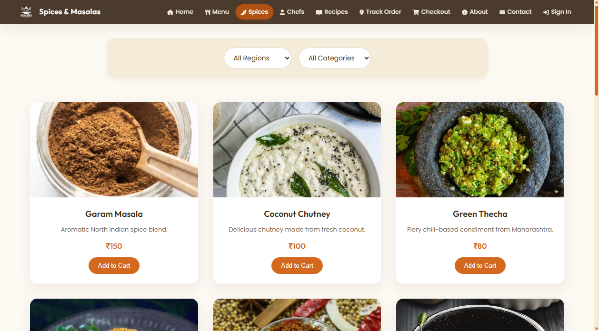
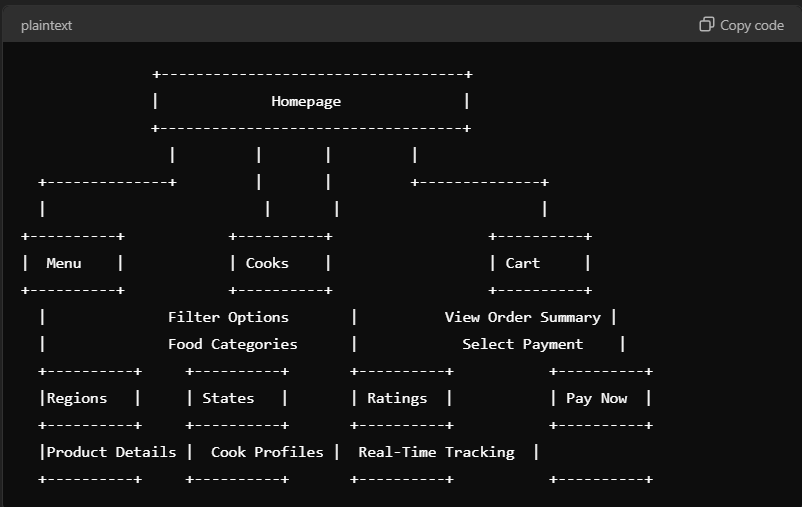

# अन्नपूर्णा (Annapurna) — Taste of Indian Tradition

[](https://html.spec.whatwg.org/)
[](https://www.w3.org/Style/CSS/)
[](https://developer.mozilla.org/en-US/docs/Web/JavaScript)
[](https://pages.github.com/)

Annapurna is a premium, fully responsive static web application that brings the rich and authentic flavors of traditional Indian home cooking to your screen. It serves as an interactive platform for exploring curated regional meals, spices, chef recipes, order tracking, and a complete shopping cart experience — all wrapped in a warm terracotta and cream design system.

🚀 **[Live Website Preview](https://rushikesh5102.github.io/Annapurna/)**

---

## 🍽️ About the Project

Annapurna is dedicated to presenting the diverse culinary legacy of India in a user-friendly, fully responsive interface. Designed with modern typography, high-quality photography, smooth parallax scrolling, and fluid micro-animations, the site acts simultaneously as an online menu, recipe catalog, and interactive checkout portal for gourmet food lovers.

### ✨ Key Features

- **Regional & Course-based Categorization** — Cuisine segmented by origin (North, South, East, West) and course (Meals, Snacks, Desserts, Beverages)
- **Interactive Flip Recipe Cards** — Premium hover cards that flip to reveal full ingredients and step-by-step cooking instructions
- **Live Cart System** — localStorage-backed cart enabling users to dynamically add spices/items and calculate checkout totals
- **Order Tracking** — Clean, mock fulfillment status tracker
- **Chef Profiles** — Showcase of featured local chefs with hover overlays and specialties
- **Sign In / Sign Up** — Tab-based authentication form with real-time client-side validation
- **Parallax Hero & Banner** — Fixed-attachment multi-food background with smooth depth scroll effect
- **Custom Scrollbar** — Terracotta/cream styled scrollbar (WebKit + Firefox supported)
- **Fully Responsive & Hamburger Drawer** — Responsive layout media queries with a custom-engineered slide-out navigation drawer and blur backdrop for mobile view across all 13 pages


---

### 📸 Website Showcase

#### Desktop Landing Page & Menu Showcase


#### Dynamic Menu Cards & Add-to-Cart


#### Traditional Recipe Catalog


---

## 📌 Repository Topics & Cuisine Focus

The site offers distinct sections capturing the full breadth of Indian gastronomy:

### 1. North Indian Delicacies
Hearty and rich recipes like *Butter Chicken*, *Chole Bhature*, *Aloo Paratha*, and *Rajma Chawal*.


### 2. South & West Indian Tastes
Includes coastal and southern items such as *Masala Dosa*, *Thalipeeth*, *Besan Bhakri*, and *Puran Poli*.


### 3. Spice & Masala Catalog
Dedicated section for authentic raw ingredients with details and pricing for spice mixtures (*Goda Masala*, *Garam Masala*, *Kashmiri Masala*).


---

## 🏗️ Architecture & Flowchart

The system layout and visual navigation flow are represented in the structural blueprint below:



---

## 📂 Directory Structure

```
Annapurna/
├── Assets/
│   ├── Images/
│   │   ├── food/           # All food & spice photography (32 JPG files)
│   │   ├── logo.png        # Brand logo
│   │   └── *.png           # Repository showcase screenshots
│   ├── Video/
│   │   └── demo.webp       # Animated demo walkthrough recording
│   └── js/
│       ├── scripts.js      # Global UI interactions & auth mockup
│       └── Spices-Checkout.js  # localStorage cart handling for spices
├── html/
│   ├── index.html          # Main landing dashboard
│   ├── Menu.html           # Dynamic food item catalog with cart
│   ├── Spices.html         # Raw spices details & listings
│   ├── Chefs.html          # Chef profiles and team showcase
│   ├── recipes.html        # Interactive recipe overlay cards
│   ├── Checkout.html       # Shopping cart & checkout overview
│   ├── order-tracking.html # Order tracking layout
│   ├── about.html          # About Us section
│   ├── contact.html        # Customer feedback & support form
│   ├── login-registration.html  # Sign In & Sign Up dashboard
│   ├── privacy.html        # Privacy Policy
│   ├── terms.html          # Terms of Service
│   ├── 404.html            # Custom 404 error page
│   └── styles.css          # Core design system & all layouts
├── index.html              # Root redirect for GitHub Pages hosting
├── Flowchart.png           # Navigation architecture diagram
├── .gitignore              # Excluded system, IDE & temp files
└── README.md               # Repository documentation
```

---

## 💻 Running the Project Locally

Since the application is built with standard web foundations (HTML5, CSS3, Vanilla JavaScript), running it locally requires no complex installation steps:

1. **Clone the repository**:
   ```bash
   git clone https://github.com/Rushikesh5102/Annapurna.git
   cd Annapurna
   ```

2. **Open the Entry Point**:
   Simply open the root `index.html` in any modern web browser:
   ```bash
   # On Windows
   start index.html

   # On macOS / Linux
   open index.html
   ```

3. **Serve via HTTP Server** (recommended for full functionality):
   ```bash
   npx http-server -p 8080 .
   ```
   Then open `http://localhost:8080` in your browser.

---

## 🛡️ License

This project is open-source and free to use for educational and portfolio purposes.  
Developed by [Rushikesh Pattiwar](https://www.linkedin.com/in/rushikeshpattiwar).
